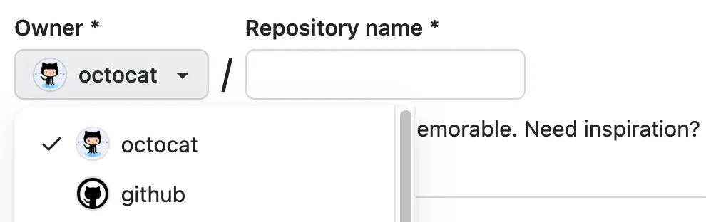
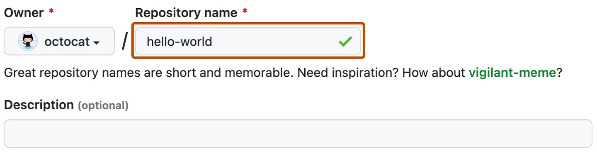

# TENK Tech Camp 2023 Frontend utvikling

Dette repoet er en template. For å bruke det, må du lage en kopi under din egen Github-konto. Det gjør du slik:

1. Klikk på **Use this template**
2. Velg **Create a new repository**

3. Bruk Owner dropdown menyen til å velge din egen konto

4. Gi repoet ditt navnet **brukernavn.github.io**, der du bytter ut «brukernavn» med brukernavnet ditt på Github.

5. Velg **Create repository from template**.

